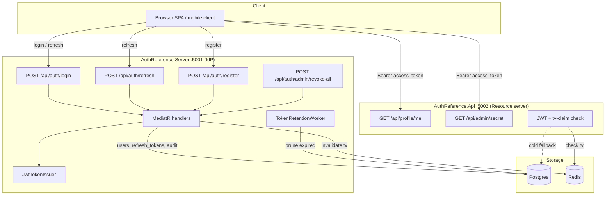
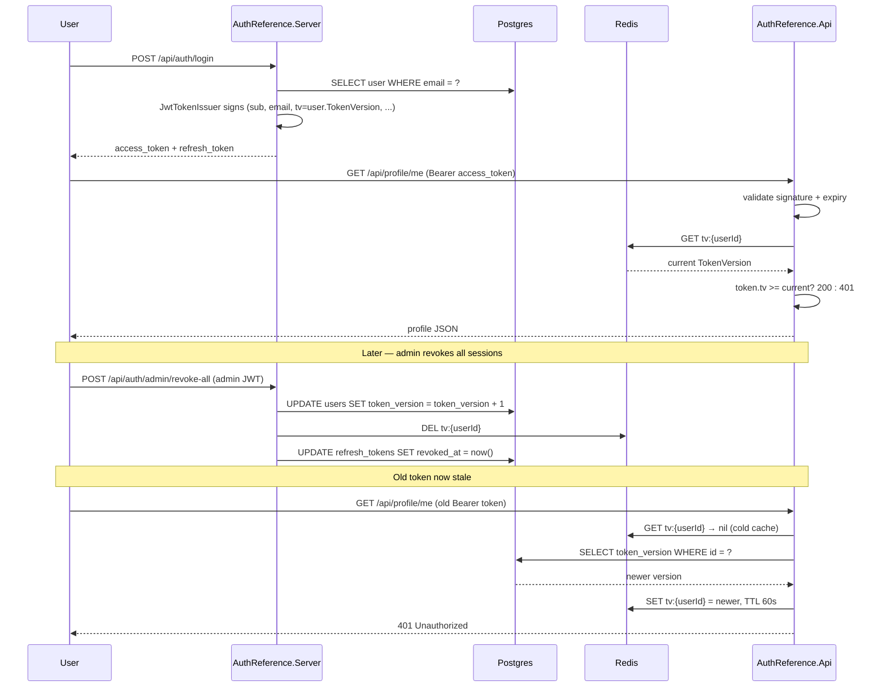

# auth-reference-dotnet

A .NET 10 identity provider + resource server pair, built layer-by-layer with Clean Architecture. Every phase is a separate commit — read the git history to see how a production-shaped auth service is put together, from the domain contracts up.

**Status: Phase 5 of 5 — complete.**

[](https://github.com/hafiz5007/auth-reference-dotnet/actions/workflows/ci.yml)


## What this is

Two runnable services:

- **`AuthReference.Server`** (port 5001) — the identity provider. Issues signed access tokens + opaque refresh tokens, rotates refresh tokens with reuse detection, enforces named per-endpoint rate limits, publishes JWKS, seeds OAuth clients on boot, runs a background retention worker.
- **`AuthReference.Api`** (port 5002) — a sample resource server that validates the Server's tokens, enforces the `tv`-claim revocation check, and exposes protected endpoints demonstrating role- and scope-based authorization.

Both are wired around three shared library projects (`Domain`, `Application`, `Infrastructure`) so a hiring reviewer can see how Clean Architecture responsibilities split cleanly in .NET.

## Architecture



## The `tv`-claim revocation pattern

Every access token carries a `tv` claim equal to the user's `TokenVersion` at issue time. Any operation that must kill outstanding sessions (password change, admin revoke-all, security incident) bumps the DB column and drops the Redis cache entry. Resource servers hit Redis on every request; a mismatch (or cold-cache Postgres re-read) returns 401. This gives immediate revocation of stateless JWTs — the pattern most senior interviews expect and few candidates can implement.



## Layer layout

```
src/
  AuthReference.Domain/               entities, value objects, service interfaces, domain events. Zero package deps.
  AuthReference.Application/          MediatR command records + handlers, FluentValidation, notification wrappers. Depends only on Domain.
  AuthReference.Infrastructure/       EF Core + Postgres, OpenIddict core + client seeder, Redis TokenVersionStore, JwtTokenIssuer, JWT bearer configuration, retention worker. Depends on Application + Domain.
  AuthReference.Server/               ASP.NET Core 10 IdP host: REPR endpoints, correlation-id middleware, PII redactor, rate limits, payload caps.
  AuthReference.Api/                  ASP.NET Core 10 resource-server host: sample protected endpoints, tv-claim enforcement via shared config.

tests/
  AuthReference.Application.Tests/    xUnit handler tests using in-memory fakes for every Domain interface.
  AuthReference.Api.Tests/            WebApplicationFactory<Program> integration tests over InMemory EF Core.
```

## Phases (git history)

| Phase | Ships | Commit |
| --- | --- | --- |
| 1 — Domain | Entities, service interfaces, domain events. Zero framework deps. | `Phase 1: Domain layer` |
| 2 — Application | MediatR CQRS + FluentValidation pipeline + refresh-token reuse detection. Unit tests. | `Phase 2: Application layer + CQRS` |
| 3 — Infrastructure | Postgres + EF Core, OpenIddict core + client seeder, PBKDF2, JWT issuance. | `Phase 3: Infrastructure - Persistence + OpenIddict core` |
| 4 — Server | REPR endpoints, correlation IDs, PII redaction, rate limits, `tv`-claim JWT validation, Redis, retention worker. | `Phase 4: Server host + operational hardening` |
| 5 — Api + tests + Docker + README | Standalone resource server, integration tests, docker-compose, CI, expanded README. | `Phase 5: Resource API + tests + Docker + README` |

## Run it

### Prerequisites

- Docker + Docker Compose (fastest)
- OR .NET 10 SDK + local Postgres + local Redis

### Fastest — everything in containers

```bash
docker compose up --build
```

Then:

```bash
# Anonymous
curl http://localhost:5002/api/public/ping

# Register + get a token pair
curl -X POST http://localhost:5001/api/auth/register \
  -H "Content-Type: application/json" \
  -d '{"email":"alice@example.com","password":"a-strong-passphrase-2026","displayName":"Alice"}'

# Use the access token
TOKEN="<paste access_token from register response>"
curl -H "Authorization: Bearer $TOKEN" http://localhost:5002/api/profile/me
```

### Local dev loop

```bash
# Terminal 1 — infra
docker run -d --name pg -e POSTGRES_USER=auth_ref -e POSTGRES_PASSWORD=auth_ref_dev_password -e POSTGRES_DB=auth_reference -p 5432:5432 postgres:16-alpine
docker run -d --name redis -p 6379:6379 redis:7-alpine

# Terminal 2 — generate the initial EF migration (one time)
dotnet ef migrations add InitialCreate \
  --project src/AuthReference.Infrastructure \
  --startup-project src/AuthReference.Server \
  --output-dir Persistence/Migrations
dotnet ef database update \
  --project src/AuthReference.Infrastructure \
  --startup-project src/AuthReference.Server

# Terminal 3 — Server (IdP)
dotnet run --project src/AuthReference.Server

# Terminal 4 — Api (resource server)
dotnet run --project src/AuthReference.Api
```

## Test

```bash
dotnet test AuthReference.sln
```

- **`AuthReference.Application.Tests`** — 15 handler + pipeline tests running against hand-rolled in-memory fakes. Zero infrastructure needed.
- **`AuthReference.Api.Tests`** — 7 integration tests over `WebApplicationFactory<Program>` with the Postgres provider swapped for InMemory. Includes the stale-`tv`-claim revocation scenario.

## Compare against the reference production service

See [`docs/comparison-and-refactor.md`](docs/comparison-and-refactor.md) for a full side-by-side against a real .NET 10 auth service — what patterns were adopted, what was deliberately left out, and why. Distinct from the reference on stack (Postgres over SQL Server), infrastructure (StackExchange.Redis direct instead of shared library), and scope (no multi-tenant, no RabbitMQ, no gRPC).

## Security posture

- Access-token lifetime **10 minutes** by default; refresh-token lifetime **14 days**. Both configurable.
- Refresh tokens are **hashed with SHA-256** before persisting — a database dump does not equal a session takeover.
- Refresh rotation is **atomic** via Postgres `ExecuteUpdateAsync` with a `Where(t => t.ReplacedById == null)` predicate. Concurrent rotates decide a single winner.
- **Reuse detection** — presenting an already-rotated token revokes every session for the user and publishes a security event.
- **PBKDF2-HMAC-SHA256 at 600k iterations** (current OWASP guideline) with silent upgrade path on iteration-count changes.
- **Constant-time password comparison** via `CryptographicOperations.FixedTimeEquals`.
- **Fail-fast on missing config** — an unset JWT signing key or Postgres connection string throws at boot rather than falling back silently.
- **PII log redaction** — Serilog enricher scrubs `password`, `refresh_token`, `client_secret`, `access_token`, and JWT-shaped strings out of log properties.
- **Payload caps** per endpoint — an oversized JSON body cannot deserialise before rate limits and validation run.
- **Named rate limits** — `auth-login` 5/min, `auth-register` 3/hr, `auth-refresh` 60/min, IP-partitioned.

## License

MIT — see [LICENSE](LICENSE).
